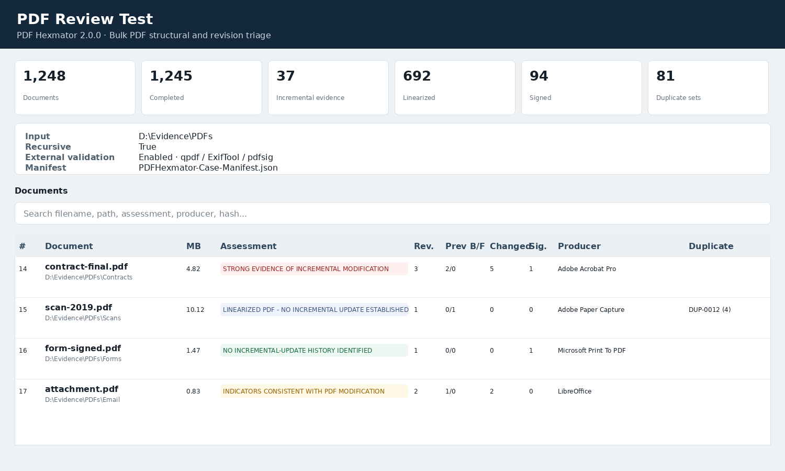
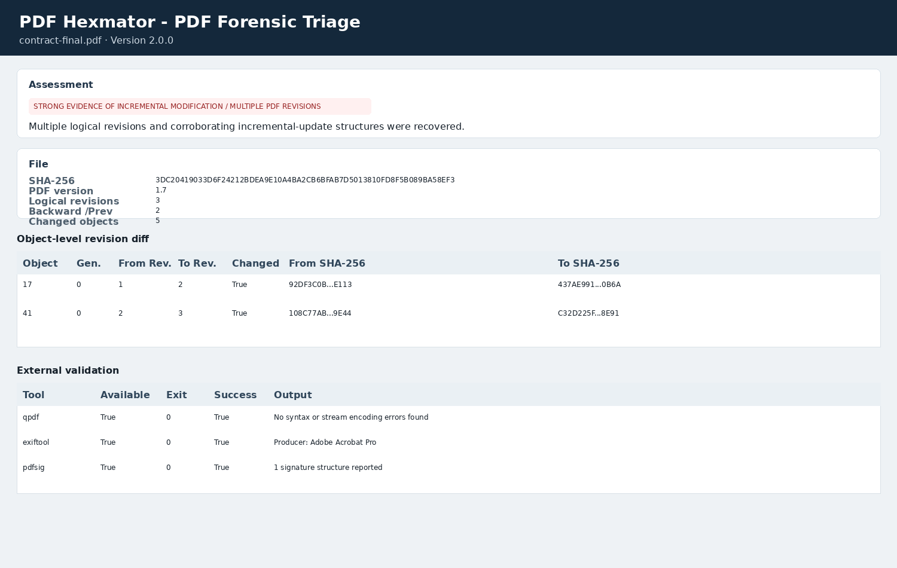

# PDF Hexmator

**PDF Hexmator** is a PowerShell-based forensic triage utility for examining PDF structure, revision history, metadata, signature-related structures, active content, and bulk document collections.

It is designed for **single-document analysis** and **high-volume folder triage** involving hundreds or thousands of PDFs. The tool emphasizes conservative interpretation: it reports observable structures and corroborating indicators rather than treating metadata or multiple `%%EOF` markers alone as proof that a document was improperly edited.

> **Version:** 2.1.1  
> **Script:** `PDFHexmator.ps1`  
> **PowerShell:** Windows PowerShell 5.1+ or PowerShell 7+  
> **Required dependencies:** None beyond PowerShell/.NET  
> **Optional corroboration:** qpdf, ExifTool, pdfsig, Didier Stevens' `pdfid.py`




## Quick overview

PDF Hexmator examines PDFs for indicators including:

- PDF header/version and unusual data before the header
- classic xref tables and XRef streams
- `trailer`, `startxref`, and `%%EOF` relationships
- incremental updates and logical revision history
- backward and forward `/Prev` relationships
- PDF linearization / Fast Web View
- redefined indirect objects
- **object-level revision diffs with SHA-256 hashes**
- data appended after the final `%%EOF`
- Creator / Producer / CreationDate / ModDate metadata
- XMP metadata
- digital-signature structures and `/ByteRange`
- post-signature bytes
- `/DocMDP` and `/FieldMDP`
- JavaScript, OpenAction, Launch, embedded files, RichMedia, AcroForm, and XFA indicators
- MD5 and SHA-256 hashing
- **hash-first SHA-256 de-duplication before deep analysis**
- one deep analysis per unique SHA-256 rather than per source file
- nested reporting of all identical source paths beneath the analyzed hash group
- recoverable logical revision carving
- optional external corroboration with third-party PDF utilities
- case-level manifests and output hash inventories

## How to run

### Analyze one PDF

```powershell
powershell -ExecutionPolicy Bypass `
  -File .\PDFHexmator.ps1 `
  -Path 'C:\Evidence\document.pdf'
```

### Analyze a folder

```powershell
powershell -ExecutionPolicy Bypass `
  -File .\PDFHexmator.ps1 `
  -Path 'C:\Evidence\PDFs' `
  -OutputDirectory 'D:\PDF-Analysis'
```

### Recursively analyze a case folder

```powershell
powershell -ExecutionPolicy Bypass `
  -File .\PDFHexmator.ps1 `
  -Path 'C:\Evidence' `
  -Recurse `
  -OutputDirectory 'D:\PDF-Analysis'
```

### Full forensic triage run

```powershell
powershell -ExecutionPolicy Bypass `
  -File .\PDFHexmator.ps1 `
  -Path 'C:\Evidence\PDFs' `
  -Recurse `
  -DetailedReports `
  -ExtractRevisions `
  -ExternalValidation `
  -CaseName 'PDF Review - Case 2026-001' `
  -OutputDirectory 'D:\Analysis\PDF-Hexmator'
```

### Analyze multiple locations

```powershell
.\PDFHexmator.ps1 `
  -Path 'D:\Set1','E:\Set2','F:\Exports\document.pdf' `
  -Recurse `
  -OutputDirectory 'D:\PDF-Analysis'
```

Duplicate input paths are de-duplicated during target discovery.

## Parameters

| Parameter | Description |
|---|---|
| `-Path` | One or more PDF files, directories, or wildcard paths. |
| `-Recurse` | Includes PDFs in nested subdirectories. |
| `-OutputDirectory` | Destination for reports, manifests, and carved revisions. |
| `-DetailedReports` | Generates one full HTML/JSON report per unique SHA-256 hash group in bulk mode. |
| `-ExtractRevisions` | Carves recoverable logical PDF revisions. |
| `-CaseName` | Friendly title for the consolidated report and case manifest. |
| `-ExternalValidation` | Attempts corroborating checks with supported third-party utilities. |
| `-ExternalToolsDirectory` | Optional directory containing external validation tools. |
| `-NoHtml` | Disables HTML output. |
| `-NoJson` | Disables JSON output. |
| `-NoCsv` | Disables both the hash-group summary CSV and full source-file inventory CSV in bulk mode. |
| `-NoManifest` | Disables the case manifest and `SHA256SUMS.txt`. |
| `-StopOnError` | Stops bulk processing on the first hashing or unique-analysis error. |

By default, an error in one PDF is recorded and the bulk run continues.

## Output

A typical bulk run produces:

```text
PDF-Analysis\
│
├── PDF-Forensic-Bulk-Report.html
├── PDF-Forensic-Bulk-Summary.csv          # one row per unique SHA-256
├── PDF-Forensic-File-Inventory.csv        # every source PDF mapped to its hash group
├── PDF-Forensic-Bulk-Summary.json         # nested hash groups + member files
├── PDFHexmator-Case-Manifest.json
├── PDFHexmator-Case-Manifest.csv
├── SHA256SUMS.txt
│
└── documents\
    ├── HASH-000001_document-one\
    │   ├── document-one.pdf-forensics.html
    │   ├── document-one.pdf-forensics.json
    │   ├── document-one.revision-object-diff.csv
    │   └── revisions\
    └── ...
```

The `documents` tree is created when detailed reports and/or revision extraction are requested. It contains **one directory per unique hash**, not one directory per source-file copy.

## Consolidated HTML report

Bulk processing is **hash-first** in v2.1.1:

```text
Discover PDFs
    ↓
SHA-256 every source PDF
    ↓
Group byte-identical files
    ↓
Select one representative per unique SHA-256
    ↓
Deep PDF analysis only on representatives
    ↓
Nest all identical source paths beneath the representative hash group
```

This means a collection containing 10,000 PDFs but only 7,000 unique SHA-256 values performs **7,000 deep PDF analyses**, while still preserving all 10,000 source paths in the report and manifest.

The bulk HTML report is self-contained, searchable, and sortable. Its primary row is a **unique hash group**, not an individual duplicate file. Each row includes an expandable list of all byte-identical PDFs in that group and clearly marks the representative file that was actually analyzed.

The dashboard reports:

- total PDFs discovered
- successfully hashed PDFs
- unique SHA-256 values
- deep analyses performed
- deep analyses avoided through de-duplication
- duplicate sets and redundant copies
- hash failures
- incremental-update indicators by unique hash
- linearized PDFs by unique hash
- signature structures
- active-content indicators
- logical revisions and physical EOF markers
- backward/forward `/Prev` counts
- changed object definitions
- optional external-validator status
- Producer/Creator metadata
- modification dates
- links to the single detailed report associated with each unique hash

### Nested duplicate example

A report row may represent:

```text
HASH-000042
SHA-256: 7A8C...D91F
Representative: D:\Evidence\Email\invoice.pdf   [ANALYZED]

3 identical PDFs
  ├─ D:\Evidence\Email\invoice.pdf             [ANALYZED]
  ├─ D:\Evidence\Exports\invoice-copy.pdf      [IDENTICAL]
  └─ E:\Production\Batch7\000124.pdf           [IDENTICAL]
```

All three paths remain evidentially visible, but the PDF parser, revision analyzer, external validators, and detailed-report generator run only once against the representative bytes.

## Object-level revision diffing

Version 2.0.0 introduced object-level comparison for repeated indirect object IDs.

When the same object/generation pair appears more than once, PDF Hexmator records each serialized object definition and calculates a SHA-256 hash. The report then compares adjacent definitions:

```text
Object 17 0
  Revision 1 -> Revision 2
  From SHA-256: 92DF...
  To SHA-256:   437A...
  Changed: True
```

This helps move the analysis from **“the file contains revisions”** toward **“these object definitions changed between revisions.”**


> Object-level diffing compares serialized indirect-object definitions. It does not yet render a page-level visual diff or semantically decode every stream.



## Linearized PDFs / Fast Web View

Linearized PDFs require special handling because normal Fast Web View structure may include:

- more than one physical `%%EOF`
- an early `startxref 0`
- a `/Prev` entry pointing **forward** toward a later xref

A naive scanner can incorrectly describe this as revision history.

PDF Hexmator distinguishes:

- **physical EOF sections**, and
- **logical PDF revisions**.

Recognized linearization-only bootstrap structures are excluded from incremental-modification scoring and revision carving.

## External validation

Use `-ExternalValidation` to attempt corroborating analysis with locally installed utilities.

Supported integrations:

| Tool | Purpose |
|---|---|
| qpdf | PDF syntax/xref/stream consistency check |
| ExifTool | Metadata corroboration |
| pdfsig | PDF signature reporting |
| Didier Stevens `pdfid.py` | Keyword/active-content corroboration |

Example:

```powershell
.\PDFHexmator.ps1 `
  -Path 'D:\Evidence' `
  -Recurse `
  -ExternalValidation
```

If tools are stored outside `PATH`:

```powershell
.\PDFHexmator.ps1 `
  -Path 'D:\Evidence' `
  -Recurse `
  -ExternalValidation `
  -ExternalToolsDirectory 'C:\ForensicTools\PDF'
```

Missing tools do not terminate the run. External results are treated as **corroborative**, not authoritative.

## Case manifest and hashing

Unless `-NoManifest` is used, PDF Hexmator generates:

- `PDFHexmator-Case-Manifest.json`
- `PDFHexmator-Case-Manifest.csv`
- `SHA256SUMS.txt`

The manifest records:

- PDF Hexmator version
- SHA-256 of the executing script
- case name
- start/completion timestamps
- command line
- PowerShell version
- host information
- run options
- source PDF hashes
- source assessments
- generated artifact hashes

This is intended to make a completed triage run easier to reproduce, audit, and preserve with case materials.

## Hash-first duplicate handling

Starting with v2.1.1, duplicate detection occurs **before** structural PDF analysis.

Every discovered PDF receives a complete-file SHA-256. Files with the same SHA-256 are byte-for-byte identical and are assigned to the same hash group:

```text
HASH-000001  SHA256=A1B2...  1 file
HASH-000002  SHA256=7A8C...  6 identical files
HASH-000003  SHA256=CC91...  3 identical files
```

Only the first deterministic representative in each group is deeply analyzed. The resulting forensic findings apply to all members because their complete file bytes are identical.

Two output views preserve both levels of information:

- **`PDF-Forensic-Bulk-Summary.csv`** — one row per unique SHA-256 / deep analysis.
- **`PDF-Forensic-File-Inventory.csv`** — one row per discovered PDF, including hash group, representative path, group size, and whether that file was the analyzed representative.

The JSON and HTML reports nest identical files beneath their hash group. This prevents duplicate copies from inflating finding counts while preserving all original source locations.

Visually identical PDFs with different binary content will have different SHA-256 values and will be analyzed separately.

## Digital signatures

PDF Hexmator looks for structures including:

```text
/Type /Sig
/ByteRange
/TransformMethod /DocMDP
/TransformMethod /FieldMDP
```

It can identify bytes that occur after a recovered signed byte range.

PDF Hexmator does **not** independently validate certificate trust, certificate chains, revocation, or cryptographic signature integrity. Use a signature-aware validator such as `pdfsig` or another trusted PDF application for that determination.

## Active content

The tool identifies lexical indicators associated with:

- JavaScript
- `/OpenAction`
- `/AA`
- `/Launch`
- embedded files
- RichMedia
- AcroForm
- XFA

These findings are triage leads. Their presence does not by itself establish malicious behavior.

## Assessment terminology

Examples include:

```text
LINEARIZED PDF - NO INCREMENTAL UPDATE ESTABLISHED
```

```text
LINEARIZED PDF - REVIEW FOR POST-LINEARIZATION CHANGES
```

```text
NO INCREMENTAL-UPDATE HISTORY IDENTIFIED BY THIS TRIAGE
```

```text
INDICATORS CONSISTENT WITH PDF MODIFICATION
```

```text
STRONG EVIDENCE OF INCREMENTAL MODIFICATION / MULTIPLE PDF REVISIONS
```

These are **structural triage assessments**. They are not opinions about motive, authenticity, fraud, or evidentiary weight.

## Forensic interpretation

### Multiple revisions do not automatically mean improper editing

Legitimate incremental updates may result from:

- digital signing
- annotations/comments
- form completion
- Bates numbering
- redaction workflows
- document-management systems
- ordinary editor saves

### No revision history does not prove a document was never edited

Prior history may be lost when a PDF is:

- fully rewritten
- optimized
- flattened
- linearized
- rasterized
- printed to PDF
- converted through another application
- sanitized

### Metadata is corroborative

Creator, Producer, CreationDate, ModDate, and XMP values can be absent, stale, overwritten, or manipulated. Treat metadata as context, not standalone proof.

## Read-only source handling

PDF Hexmator does not intentionally modify source PDFs. Input files are read for analysis; generated reports, hashes, manifests, and carved revisions are written to the output directory.

Normal forensic evidence-handling procedures should still be followed, including analysis from verified copies where appropriate.

## Performance

Bulk processing uses two sequential phases for Windows PowerShell 5.1 compatibility and predictable memory usage:

1. **Hash inventory** — SHA-256 every discovered PDF without deep parsing.
2. **Unique analysis** — deeply analyze one representative for each unique SHA-256.

Only one file is actively processed at a time. This preserves predictable memory use while avoiding repeated structural analysis, external-tool execution, revision extraction, and detailed-report generation for byte-identical copies.

Example:

```text
PDFs discovered       25,000
Unique SHA-256        14,200
Redundant copies      10,800
Deep analyses run     14,200
Deep analyses avoided 10,800
```

The representative SHA-256 is checked again during deep analysis. If the file changes between the hash-inventory phase and analysis phase, the group is reported as an error instead of silently applying stale results.

## Recommended workflow

1. Run PDF Hexmator across the full collection; the tool hashes everything first and automatically reduces the set to unique SHA-256 values.
2. Review the consolidated HTML dashboard and expand hash groups when source-location context matters.
3. Filter the hash-group CSV for:
   - backward `/Prev`
   - multiple logical revisions
   - changed/redefined objects
   - high-severity findings
   - post-signature bytes
   - unusual Producer metadata
   - active content
4. Use `PDF-Forensic-File-Inventory.csv` when you need every original path associated with a hash group.
5. Open the single detailed report for each unique hash of interest.
6. Review object-level revision diffs.
7. Extract recoverable revisions.
8. Corroborate important findings with a second standards-aware tool.
9. Preserve the case manifest and `SHA256SUMS.txt` with the examination output.

## Testing

The repository contains synthetic regression fixtures covering:

- normal PDF
- exact duplicate with hash-first single-analysis validation
- incremental update
- multiple revisions
- linearized PDF
- signature structures
- appended data
- malformed PDF

Run the Pester suite:

```powershell
Install-Module Pester -Scope CurrentUser -Force -MinimumVersion 5.5.0
Invoke-Pester -Path .\tests\PDFHexmator.Tests.ps1 -Output Detailed
```

GitHub Actions runs the suite on both:

- Windows PowerShell 5.1
- PowerShell 7

The test PDFs are synthetic and contain no case evidence or personal data.

## Repository layout

```text
PDF-Hexmator/
│
├── PDFHexmator.ps1
├── README.md
├── CHANGELOG.md
├── RELEASE_NOTES_v2.1.1.md
├── LICENSE
├── CONTRIBUTING.md
├── SECURITY.md
│
├── docs/
│   └── images/
│       ├── bulk-dashboard.png
│       └── document-report.png
│
├── tests/
│   ├── PDFHexmator.Tests.ps1
│   └── fixtures/
│       └── *.pdf
│
└── .github/
    ├── release.yml
    └── workflows/
        └── pester.yml
```

## Limitations

PDF is a complex format. Current limitations include:

- compressed object streams may limit lexical object recovery
- malformed PDFs may produce incomplete results
- a full rewrite may remove revision history
- metadata can be inaccurate or intentionally manipulated
- signature structures are detected but not cryptographically validated internally
- object-level diffs do not yet equal page-level visual diffs
- embedded/content streams are not comprehensively decoded and semantically compared
- significant findings should be independently corroborated for evidentiary use

## Roadmap

Potential follow-on work:

- page-level rendered revision comparison
- content-stream decoding and semantic text differences
- additional xref/object-stream decoding
- resumable/checkpointed bulk scans
- opt-in PowerShell 7 parallel mode
- YARA-style PDF structural rules
- tighter forensic-suite integrations

## Acknowledgements

PDF Hexmator was informed by PDF structural-analysis concepts and prior community work, including:

- [PDF-Processing by jjrboucher](https://github.com/jjrboucher/PDF-Processing)
- PDF binary-template work by Didier Stevens, Christian Mehlmauer, Peter Wyatt, and the broader PDF analysis community

These references helped inform examination of PDF headers, objects, cross-reference structures, trailers, `startxref`, `%%EOF`, linearization, and incremental updates.

## License

PDF Hexmator is released under the [MIT License](LICENSE).

## Disclaimer

PDF Hexmator is an investigative and forensic triage utility. Results should be interpreted in context and independently validated before being used for evidentiary conclusions. Structural indicators may reflect legitimate PDF processing, and the absence of an indicator does not prove that a document has never been modified.
